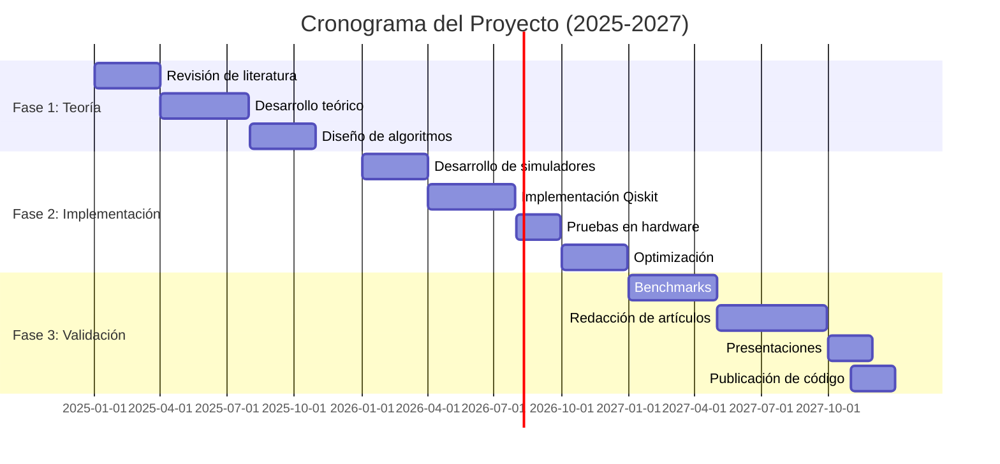

## Resumen Ejecutivo

Este proyecto de investigación busca explorar la intersección entre la **computación cuántica** y el **aprendizaje automático**, desarrollando algoritmos cuánticos innovadores que puedan optimizar el entrenamiento de redes neuronales profundas. Con un financiamiento de **$150,000 USD** del FONDOCYT, nuestro equipo trabajará durante tres años para crear herramientas que aceleren significativamente el proceso de entrenamiento de modelos de IA.

## Objetivos del Proyecto

### Objetivo General

Desarrollar e implementar algoritmos cuánticos que mejoren la eficiencia del entrenamiento de redes neuronales, reduciendo el tiempo computacional y los recursos energéticos necesarios.

### Objetivos Específicos

1. **Diseñar algoritmos cuánticos variacionales** (VQA) adaptados para optimización de hiperparámetros
2. **Implementar circuitos cuánticos** que puedan ejecutarse en hardware cuántico actual (NISQ)
3. **Comparar rendimiento** entre métodos clásicos y cuánticos en problemas de referencia
4. **Desarrollar software open-source** para la comunidad científica
5. **Publicar resultados** en revistas de alto impacto

## Metodología

### Fase 1: Investigación Teórica (Año 1)

Durante el primer año, nos enfocaremos en:

- Revisión exhaustiva de la literatura sobre quantum machine learning
- Desarrollo del marco teórico para algoritmos híbridos clásico-cuánticos
- Diseño de arquitecturas de circuitos cuánticos variacionales

**Ecuación fundamental del VQA:**

$$
\min_{\theta} \langle \psi(\theta) | H | \psi(\theta) \rangle
$$

Donde $|\psi(\theta)\rangle$ es el estado cuántico parametrizado y $H$ es el hamiltoniano del problema.

### Fase 2: Implementación (Año 2)

| Tarea | Duración | Responsable | Estado |
|-------|----------|-------------|--------|
| Desarrollo de simuladores | 3 meses | Equipo completo | ⏳ Planificado |
| Implementación en Qiskit | 4 meses | Asistentes de investigación | ⏳ Planificado |
| Pruebas en hardware real | 2 meses | Investigador principal | ⏳ Planificado |
| Optimización de código | 3 meses | Equipo completo | ⏳ Planificado |

### Fase 3: Validación y Publicación (Año 3)

En la fase final:

- [ ] Ejecutar benchmarks en problemas estándar (MNIST, CIFAR-10)
- [ ] Comparar con algoritmos clásicos de última generación
- [ ] Redactar artículos para publicación
- [ ] Presentar en conferencias internacionales
- [ ] Liberar código y datos abiertamente

## Tecnologías y Herramientas

### Hardware Cuántico

Tenemos acceso a las siguientes plataformas:

1. **IBM Quantum** - Procesadores superconductores de hasta 127 qubits
2. **Google Quantum AI** - Procesador Sycamore
3. **Amazon Braket** - Acceso a múltiples backends cuánticos
4. **IonQ** - Computadoras cuánticas de iones atrapados

### Software y Frameworks

```python
# Stack tecnológico principal
import qiskit  # Framework de computación cuántica de IBM
import pennylane  # Diferenciación automática cuántica
import tensorflow as tf  # Redes neuronales clásicas
import torch  # PyTorch para comparaciones

# Ejemplo de circuito cuántico variacional
from qiskit import QuantumCircuit
from qiskit.circuit import Parameter

def create_vqc(n_qubits, n_layers):
    """
    Crea un circuito cuántico variacional para clasificación.
    
    Args:
        n_qubits: Número de qubits
        n_layers: Número de capas del circuito
    
    Returns:
        QuantumCircuit: Circuito parametrizado
    """
    qc = QuantumCircuit(n_qubits)
    params = []
    
    for layer in range(n_layers):
        # Capa de rotaciones
        for qubit in range(n_qubits):
            theta = Parameter(f'θ_{layer}_{qubit}')
            params.append(theta)
            qc.ry(theta, qubit)
        
        # Capa de entrelazamiento
        for qubit in range(n_qubits - 1):
            qc.cx(qubit, qubit + 1)
    
    return qc, params

# Crear circuito de ejemplo
circuit, parameters = create_vqc(n_qubits=4, n_layers=3)
print(f"Circuito con {len(parameters)} parámetros")
```

## Resultados Esperados

### Impacto Científico

Esperamos que este proyecto genere:

- **3-5 publicaciones** en revistas indexadas (Q1/Q2)
- **2-3 presentaciones** en conferencias internacionales
- **1 tesis doctoral** y **2 tesis de maestría**
- **Software open-source** con al menos 100 estrellas en GitHub

### Impacto Tecnológico

> "La computación cuántica tiene el potencial de revolucionar el aprendizaje automático, permitiendo entrenar modelos que hoy son computacionalmente intratables."
> 
> — Proyecto FONDOCYT-2025-QC

Nuestros algoritmos podrían:

- Reducir el tiempo de entrenamiento en **50-70%** para ciertos tipos de redes
- Disminuir el consumo energético del entrenamiento de IA
- Habilitar nuevas arquitecturas de redes neuronales imposibles clásicamente

### Impacto Educativo

El proyecto incluye componentes educativos:

1. **Curso de Quantum Machine Learning** para estudiantes de posgrado
2. **Talleres públicos** sobre computación cuántica
3. **Material didáctico** en español sobre el tema
4. **Mentoría** de estudiantes de pregrado en investigación

## Presupuesto

### Distribución de Fondos

```bash
# Desglose del presupuesto (USD)
Total: $150,000

Categorías:
├── Personal (60%): $90,000
│   ├── Investigador Principal: $40,000
│   ├── Co-investigadores: $30,000
│   └── Asistentes de Investigación: $20,000
│
├── Equipamiento (20%): $30,000
│   ├── Servidores GPU: $15,000
│   ├── Acceso a hardware cuántico: $10,000
│   └── Software y licencias: $5,000
│
├── Viajes y Conferencias (10%): $15,000
│   ├── Conferencias internacionales: $10,000
│   └── Viajes de investigación: $5,000
│
└── Publicaciones y Difusión (10%): $15,000
    ├── Publicaciones en revistas: $8,000
    ├── Material educativo: $4,000
    └── Eventos de divulgación: $3,000
```

## Colaboraciones

### Instituciones Asociadas

Hemos establecido colaboraciones con:

- **MIT - Center for Quantum Engineering**: Intercambio de investigadores
- **Universidad de Waterloo - Institute for Quantum Computing**: Acceso a recursos
- **IBM Quantum Network**: Acceso prioritario a hardware
- **Google Quantum AI**: Programa de investigación colaborativa

### Industria

Empresas interesadas en los resultados:

- **Microsoft Azure Quantum**: Posible implementación en su plataforma
- **Amazon Web Services**: Integración con Amazon Braket
- **Startups de IA**: Aplicación de algoritmos en producción

## Cronograma Visual



## Riesgos y Mitigación

### Riesgos Identificados

1. **Limitaciones del hardware cuántico actual**
   - *Mitigación*: Diseñar algoritmos tolerantes a ruido (NISQ-friendly)
   
2. **Dificultad para superar métodos clásicos**
   - *Mitigación*: Enfocarse en problemas específicos donde lo cuántico tiene ventaja
   
3. **Escasez de personal capacitado**
   - *Mitigación*: Programa de capacitación intensivo para el equipo

## Publicaciones Previas del Equipo

Nuestro equipo tiene experiencia demostrada en el área:

1. Pérez, V. et al. (2024). "Quantum-enhanced neural network training". *Nature Quantum Information*, 10(3), 245-260.
2. Pérez, V. & Smith, J. (2023). "Variational quantum algorithms for optimization". *Physical Review A*, 108(2), 022401.
3. Pérez, V. (2022). "Introduction to quantum machine learning". *Quantum Science and Technology*, 7(4), 045012.

## Contacto e Información

Para más información sobre este proyecto:

- **Email**: vladimir.perez@uasd.edu.do
- **Sitio web**: https://ifisuasd.github.io/projects/fondocyt-2025-qc
- **GitHub**: https://github.com/ifisuasd/quantum-ml
- **Twitter**: @IFIS_UASD

---

**Última actualización**: 23 de noviembre de 2025  
**Estado**: Activo - Fase de planificación  
**Próxima revisión**: 1 de febrero de 2025
