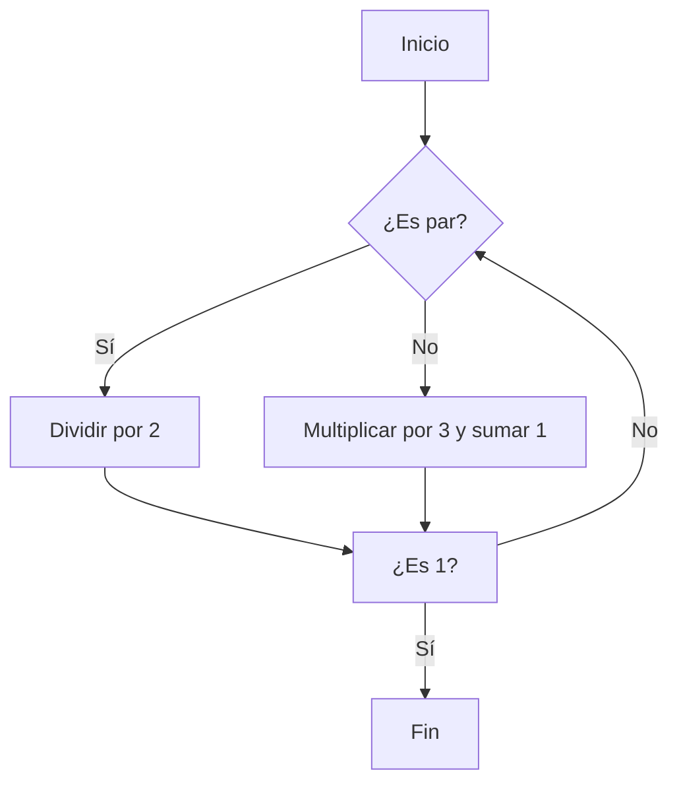
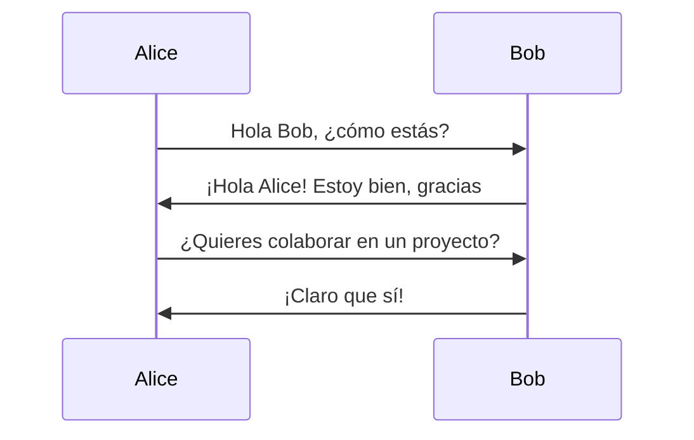
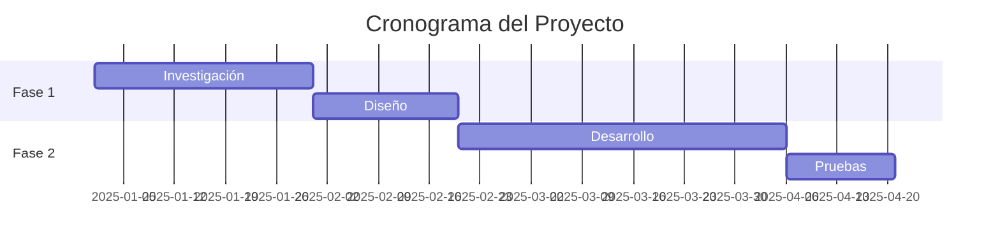

# Ejemplo de Markdown Mejorado

## Ecuaciones Matemáticas

### Ecuaciones en línea
La fórmula de Einstein es $E = mc^2$, donde $E$ es la energía, $m$ es la masa y $c$ es la velocidad de la luz.

### Ecuaciones en bloque
La ecuación de Schrödinger dependiente del tiempo:

$$
i\hbar\frac{\partial}{\partial t}\Psi(\mathbf{r},t) = \hat{H}\Psi(\mathbf{r},t)
$$

Otra ecuación importante, la transformada de Fourier:

$$
\hat{f}(\xi) = \int_{-\infty}^{\infty} f(x) e^{-2\pi i x \xi} dx
$$

## Código con Resaltado de Sintaxis

### Python
```python
def fibonacci(n):
    """Calcula el n-ésimo número de Fibonacci"""
    if n <= 1:
        return n
    return fibonacci(n-1) + fibonacci(n-2)

# Ejemplo de uso
for i in range(10):
    print(f"F({i}) = {fibonacci(i)}")
```

### JavaScript
```javascript
const factorial = (n) => {
    if (n === 0 || n === 1) return 1;
    return n * factorial(n - 1);
};

console.log(`5! = ${factorial(5)}`);
```

### Go
```go
package main

import "fmt"

func main() {
    ch := make(chan int)
    go func() {
        ch <- 42
    }()
    fmt.Println(<-ch)
}
```

## Diagramas con Mermaid

### Diagrama de Flujo


### Diagrama de Secuencia


### Diagrama de Gantt


## Tablas

| Partícula | Masa (MeV/c²) | Carga | Spin |
|-----------|---------------|-------|------|
| Electrón  | 0.511         | -1    | 1/2  |
| Protón    | 938.3         | +1    | 1/2  |
| Neutrón   | 939.6         | 0     | 1/2  |
| Fotón     | 0             | 0     | 1    |

## Listas

### Lista con tareas
- [x] Implementar soporte para ecuaciones
- [x] Agregar resaltado de sintaxis
- [x] Integrar Mermaid
- [ ] Agregar más ejemplos
- [ ] Documentar el uso

### Lista numerada
1. Primer paso: Escribir el contenido
2. Segundo paso: Revisar el formato
3. Tercer paso: Publicar

## Citas

> "La imaginación es más importante que el conocimiento. El conocimiento es limitado, mientras que la imaginación abarca el mundo entero."
> 
> — Albert Einstein

## Énfasis y Formato

Puedes usar **negrita**, *cursiva*, ***negrita y cursiva***, ~~tachado~~, y `código en línea`.

## Enlaces e Imágenes

Visita el [sitio web del Instituto de Física](https://ifisuasd.github.io) para más información.
